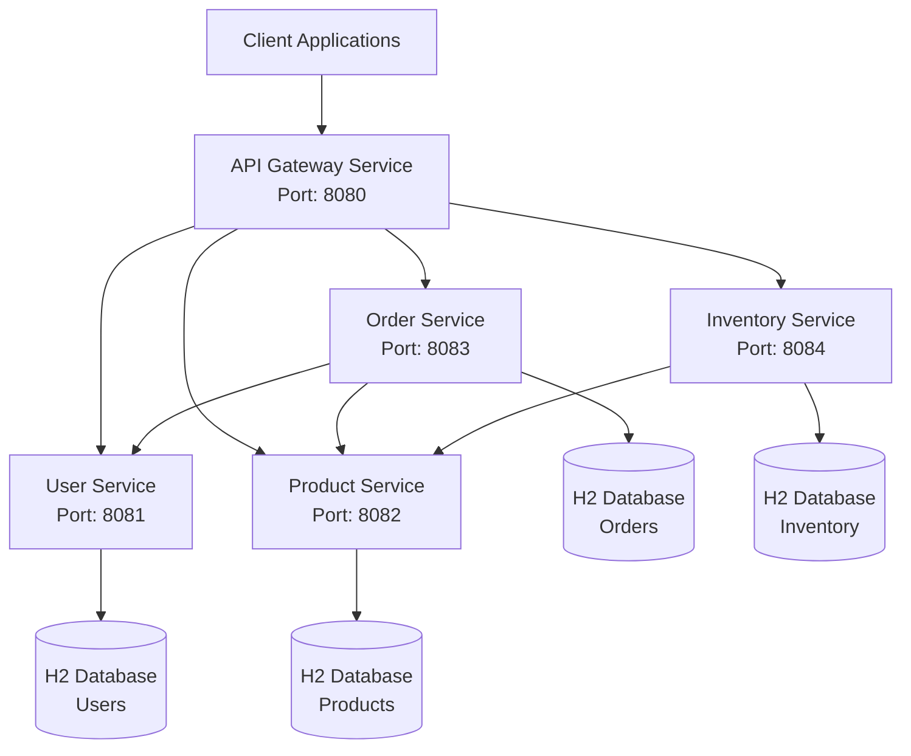

# Design Document

## Overview

The Spring Boot microservices sample application will consist of 5 independent services designed to demonstrate core microservices patterns. Each service will be a standalone Spring Boot application with its own database, REST API, and minimal dependencies. The architecture follows domain-driven design principles with clear service boundaries and REST-based communication.

## Architecture



### Service Communication Pattern

- **Synchronous Communication**: REST APIs over HTTP for real-time operations
- **Service Discovery**: Hard-coded service URLs for simplicity (suitable for learning)
- **Error Handling**: Circuit breaker pattern using basic try-catch with fallback responses
- **Data Consistency**: Eventually consistent model with service-owned data

## Components and Interfaces

### 1. User Service (Port: 8081)

**Responsibilities:**
- User account management (CRUD operations)
- User authentication data storage
- User profile information

**REST Endpoints:**
```
GET    /api/users          - Get all users
GET    /api/users/{id}     - Get user by ID
POST   /api/users          - Create new user
PUT    /api/users/{id}     - Update user
DELETE /api/users/{id}     - Delete user
GET    /api/users/health   - Health check
```

**Dependencies:**
- spring-boot-starter-web
- spring-boot-starter-data-jpa
- h2
- spring-boot-starter-validation

### 2. Product Service (Port: 8082)

**Responsibilities:**
- Product catalog management
- Product information and pricing
- Product categories and metadata

**REST Endpoints:**
```
GET    /api/products          - Get all products
GET    /api/products/{id}     - Get product by ID
POST   /api/products          - Create new product
PUT    /api/products/{id}     - Update product
DELETE /api/products/{id}     - Delete product
GET    /api/products/category/{category} - Get products by category
GET    /api/products/health   - Health check
```

**Dependencies:**
- spring-boot-starter-web
- spring-boot-starter-data-jpa
- h2
- spring-boot-starter-validation

### 3. Order Service (Port: 8083)

**Responsibilities:**
- Order creation and management
- Order status tracking
- Integration with User and Product services

**REST Endpoints:**
```
GET    /api/orders          - Get all orders
GET    /api/orders/{id}     - Get order by ID
GET    /api/orders/user/{userId} - Get orders by user
POST   /api/orders          - Create new order
PUT    /api/orders/{id}     - Update order status
DELETE /api/orders/{id}     - Cancel order
GET    /api/orders/health   - Health check
```

**External Service Calls:**
- User Service: Validate user existence
- Product Service: Validate products and get pricing

**Dependencies:**
- spring-boot-starter-web
- spring-boot-starter-data-jpa
- h2
- spring-boot-starter-validation
- spring-web (for RestTemplate)

### 4. Inventory Service (Port: 8084)

**Responsibilities:**
- Stock level management
- Inventory tracking and updates
- Stock availability checks

**REST Endpoints:**
```
GET    /api/inventory          - Get all inventory items
GET    /api/inventory/{productId} - Get inventory for product
POST   /api/inventory          - Add inventory item
PUT    /api/inventory/{productId} - Update stock level
DELETE /api/inventory/{productId} - Remove inventory item
POST   /api/inventory/{productId}/reserve - Reserve stock
POST   /api/inventory/{productId}/release - Release reserved stock
GET    /api/inventory/health   - Health check
```

**Dependencies:**
- spring-boot-starter-web
- spring-boot-starter-data-jpa
- h2
- spring-boot-starter-validation

### 5. API Gateway Service (Port: 8080)

**Responsibilities:**
- Single entry point for client requests
- Request routing to appropriate services
- Basic load balancing and error handling

**Gateway Routes:**
```
/api/users/**     -> User Service (8081)
/api/products/**  -> Product Service (8082)
/api/orders/**    -> Order Service (8083)
/api/inventory/** -> Inventory Service (8084)
```

**Dependencies:**
- spring-boot-starter-web
- spring-cloud-starter-gateway (or custom controller-based routing)

## Data Models

### User Service Models

```java
@Entity
public class User {
    @Id
    @GeneratedValue(strategy = GenerationType.IDENTITY)
    private Long id;
    
    @NotBlank
    private String username;
    
    @Email
    private String email;
    
    @NotBlank
    private String firstName;
    
    @NotBlank
    private String lastName;
    
    private LocalDateTime createdAt;
    private LocalDateTime updatedAt;
}
```

### Product Service Models

```java
@Entity
public class Product {
    @Id
    @GeneratedValue(strategy = GenerationType.IDENTITY)
    private Long id;
    
    @NotBlank
    private String name;
    
    private String description;
    
    @DecimalMin("0.0")
    private BigDecimal price;
    
    private String category;
    
    private LocalDateTime createdAt;
    private LocalDateTime updatedAt;
}
```

### Order Service Models

```java
@Entity
public class Order {
    @Id
    @GeneratedValue(strategy = GenerationType.IDENTITY)
    private Long id;
    
    @NotNull
    private Long userId;
    
    @OneToMany(cascade = CascadeType.ALL, fetch = FetchType.LAZY)
    private List<OrderItem> orderItems;
    
    @Enumerated(EnumType.STRING)
    private OrderStatus status;
    
    private BigDecimal totalAmount;
    
    private LocalDateTime createdAt;
    private LocalDateTime updatedAt;
}

@Entity
public class OrderItem {
    @Id
    @GeneratedValue(strategy = GenerationType.IDENTITY)
    private Long id;
    
    @NotNull
    private Long productId;
    
    @Min(1)
    private Integer quantity;
    
    private BigDecimal unitPrice;
}
```

### Inventory Service Models

```java
@Entity
public class InventoryItem {
    @Id
    @GeneratedValue(strategy = GenerationType.IDENTITY)
    private Long id;
    
    @NotNull
    @Column(unique = true)
    private Long productId;
    
    @Min(0)
    private Integer availableStock;
    
    @Min(0)
    private Integer reservedStock;
    
    private LocalDateTime lastUpdated;
}
```

## Error Handling

### Global Exception Handling

Each service will implement a global exception handler using `@ControllerAdvice`:

```java
@ControllerAdvice
public class GlobalExceptionHandler {
    
    @ExceptionHandler(ResourceNotFoundException.class)
    public ResponseEntity<ErrorResponse> handleNotFound(ResourceNotFoundException ex) {
        return ResponseEntity.status(HttpStatus.NOT_FOUND)
            .body(new ErrorResponse("RESOURCE_NOT_FOUND", ex.getMessage()));
    }
    
    @ExceptionHandler(ValidationException.class)
    public ResponseEntity<ErrorResponse> handleValidation(ValidationException ex) {
        return ResponseEntity.status(HttpStatus.BAD_REQUEST)
            .body(new ErrorResponse("VALIDATION_ERROR", ex.getMessage()));
    }
    
    @ExceptionHandler(ServiceCommunicationException.class)
    public ResponseEntity<ErrorResponse> handleServiceCommunication(ServiceCommunicationException ex) {
        return ResponseEntity.status(HttpStatus.SERVICE_UNAVAILABLE)
            .body(new ErrorResponse("SERVICE_UNAVAILABLE", ex.getMessage()));
    }
}
```

### Service Communication Error Handling

For inter-service communication, implement retry logic and fallback mechanisms:

```java
@Service
public class UserServiceClient {
    
    private final RestTemplate restTemplate;
    private final String userServiceUrl = "http://localhost:8081";
    
    public Optional<User> getUserById(Long userId) {
        try {
            ResponseEntity<User> response = restTemplate.getForEntity(
                userServiceUrl + "/api/users/" + userId, User.class);
            return Optional.ofNullable(response.getBody());
        } catch (Exception ex) {
            log.error("Failed to fetch user with ID: {}", userId, ex);
            return Optional.empty();
        }
    }
}
```

## Testing Strategy

### Unit Testing

Each service will include comprehensive unit tests:

- **Repository Tests**: Test data access layer with `@DataJpaTest`
- **Service Tests**: Test business logic with mocked dependencies
- **Controller Tests**: Test REST endpoints with `@WebMvcTest`

### Integration Testing

- **Service Integration Tests**: Test complete service functionality with `@SpringBootTest`
- **Database Integration**: Test with H2 in-memory database
- **API Integration**: Test REST endpoints end-to-end

### Test Structure per Service

```
src/test/java/
├── controller/
│   ├── UserControllerTest.java
│   └── UserControllerIntegrationTest.java
├── service/
│   └── UserServiceTest.java
├── repository/
│   └── UserRepositoryTest.java
└── integration/
    └── UserServiceIntegrationTest.java
```

### Mock External Services

For Order Service testing, mock external service calls:

```java
@MockBean
private UserServiceClient userServiceClient;

@MockBean
private ProductServiceClient productServiceClient;
```

## Configuration Management

### Application Properties Structure

Each service will have its own `application.yml`:

```yaml
server:
  port: 8081  # Different for each service

spring:
  application:
    name: user-service
  
  datasource:
    url: jdbc:h2:mem:userdb
    driver-class-name: org.h2.Driver
    username: sa
    password: 
  
  h2:
    console:
      enabled: true
      path: /h2-console
  
  jpa:
    hibernate:
      ddl-auto: create-drop
    show-sql: true
    database-platform: org.hibernate.dialect.H2Dialect

logging:
  level:
    com.example.userservice: DEBUG
    org.springframework.web: DEBUG

# Service URLs for inter-service communication
services:
  user-service: http://localhost:8081
  product-service: http://localhost:8082
  order-service: http://localhost:8083
  inventory-service: http://localhost:8084
```

## Project Structure

```
spring-microservices-sample/
├── README.md
├── user-service/
│   ├── pom.xml
│   └── src/main/java/com/example/userservice/
├── product-service/
│   ├── pom.xml
│   └── src/main/java/com/example/productservice/
├── order-service/
│   ├── pom.xml
│   └── src/main/java/com/example/orderservice/
├── inventory-service/
│   ├── pom.xml
│   └── src/main/java/com/example/inventoryservice/
└── api-gateway/
    ├── pom.xml
    └── src/main/java/com/example/apigateway/
```

Each service follows standard Spring Boot project structure with controllers, services, repositories, and models packages.